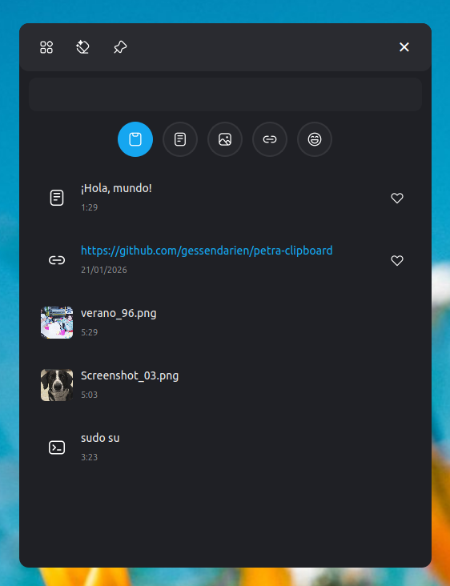
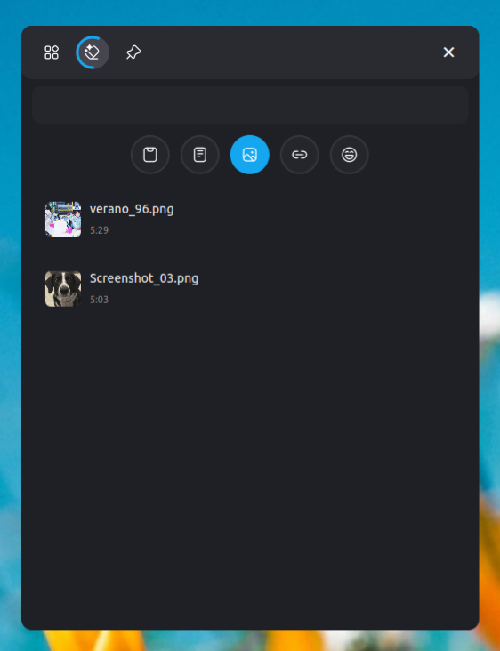
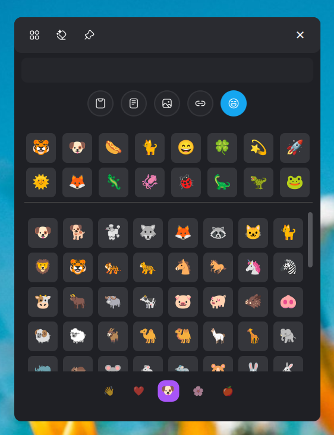
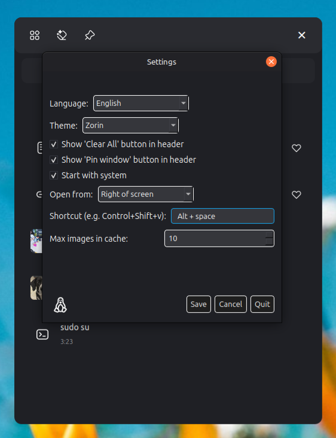
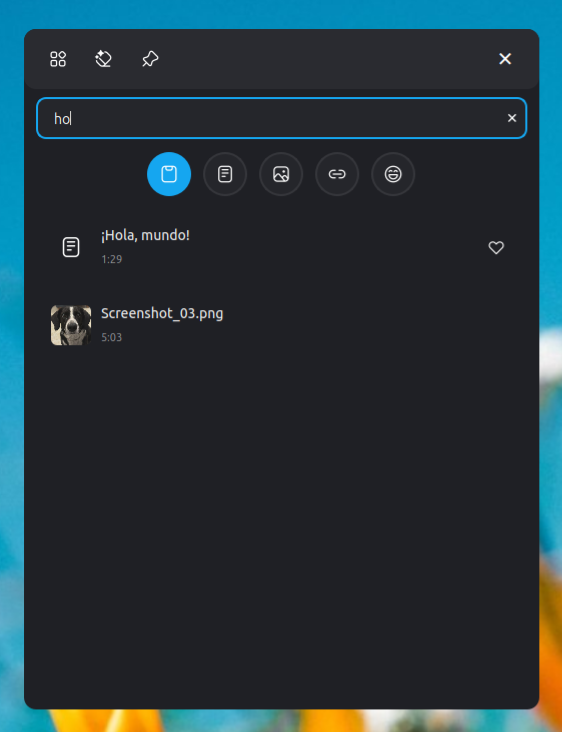
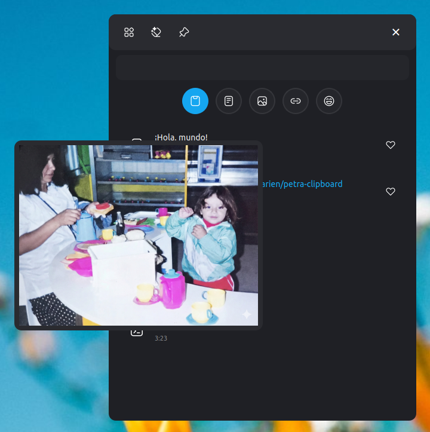

  

# Petra


A different clipboard for Linux, my way.

## Features

- Allows copying and pasting text, images, links, console commands, and emojis
- Filter by copied item type
- General search, by type or emoji
- Open links directly in the browser
- Keyboard navigation (q, w, ctrl+f, esc, and arrow keys)
- Preview copied image
- Pin window
- Wide variety of themes and colors
- Start on system boot
- Save items and manually delete them or clear all
- Open on the left or right of the screen or at mouse position
- Choose keyboard shortcut

## Screenshots








## Installation

You can install Petra or generate distributable packages by running the included build script in the project folder:

```bash
./install.sh
```

This will launch an interactive menu with the following options:
1. **Build & Install Locally** (Directly installs a development Flatpak)
2. **Create Flatpak Bundle & Install** (Generates a `.flatpak` and installs it)
3. **Create Flatpak Bundle Only** (Generates a `.flatpak` for distribution)
4. **Create Debian Package** (Generates a `.deb` package)
5. **Create AppImage** (Generates a fully standalone `.AppImage` portable executable)

All generated bundles are saved in the `output/` directory.

## License

GPL-3.0

## Credits

Icons by [ProCode](https://github.com/ProCode-Software/proicons)

---

<p align="center">
  <a href="https://paypal.me/gessendarien" target="_blank">
    
  </a>
</p>

<p align="center">
  <sub>Made with 💚</sub>
</p>
